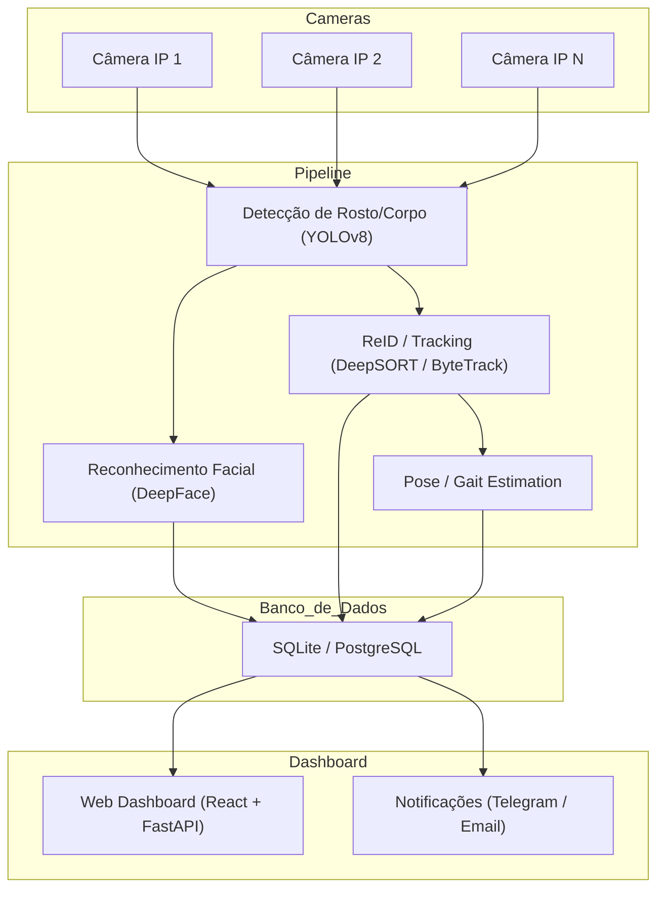

# Diagramas Mermaid do HomeGuard

Todos os diagramas estão dentro de `docs/diagramas/` e cada um possui uma descrição detalhada para explicar o fluxo de dados e funcionamento do HomeGuard.

---

## 1. Arquitetura Geral (`arquitetura.md`)

**Descrição:** Este diagrama mostra a arquitetura global do HomeGuard, incluindo as câmeras, pipeline de detecção e reconhecimento, banco de dados, dashboard e sistema de alertas.

**Passo a Passo:**

1. **Câmeras IP (C1, C2, C3…)**: Capturam vídeo em tempo real do ambiente.
2. **Detecção de Rosto/Corpo (YOLOv8)**: Identifica rostos e pessoas.
3. **Reconhecimento Facial (DeepFace)**: Compara rostos detectados com o banco.
4. **ReID / Tracking (DeepSORT / ByteTrack)**: Mantém a identificação mesmo se o rosto não estiver visível.
5. **Pose / Gait Estimation**: Avalia postura ou caminhada para complementar a identificação.
6. **Banco de Dados (SQLite/PostgreSQL)**: Armazena pessoas cadastradas, eventos e embeddings.
7. **Dashboard Web (React + FastAPI)**: Visualiza eventos em tempo real.
8. **Notificações (Telegram / Email)**: Dispara alertas quando necessário.

