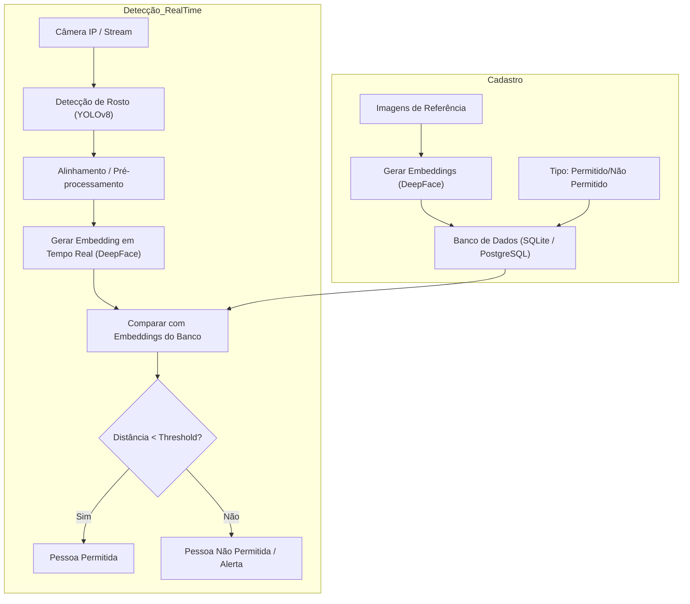

## 2. Fluxo de Embeddings (`embeddings.md`)

**Descrição:** Mostra como as imagens de referência são transformadas em embeddings e como o sistema compara rostos detectados em tempo real para determinar se são permitidos ou não.

**Passo a Passo:**
**Cadastro:**

1. Recebe imagens de referência.
2. Gera embeddings com DeepFace.
3. Salva embeddings no banco com tipo (permitido/não permitido).

**Detecção em Tempo Real:** 4. Câmera captura vídeo. 5. Detecção de rosto com YOLOv8. 6. Alinhamento e pré-processamento. 7. Geração de embedding em tempo real. 8. Comparação com embeddings cadastrados. 9. Distância < threshold → pessoa permitida. 10. Distância ≥ threshold → pessoa não permitida, alerta.

