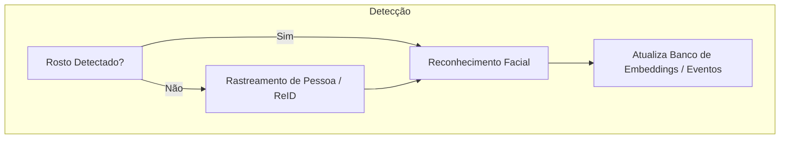

## 3. Fallback / Tracking (`fallback_tracking.md`)

**Descrição:** Mostra como o sistema lida com rostos não detectados usando tracking e ReID.

**Passo a Passo:**

1. Verifica se o rosto foi detectado.
2. Se não detectado, aplica tracking/ReID.
3. Se detectado, passa pelo reconhecimento facial.
4. Banco de dados é atualizado com o evento.
5. Permite identificação mesmo com rosto coberto ou ângulo ruim.

