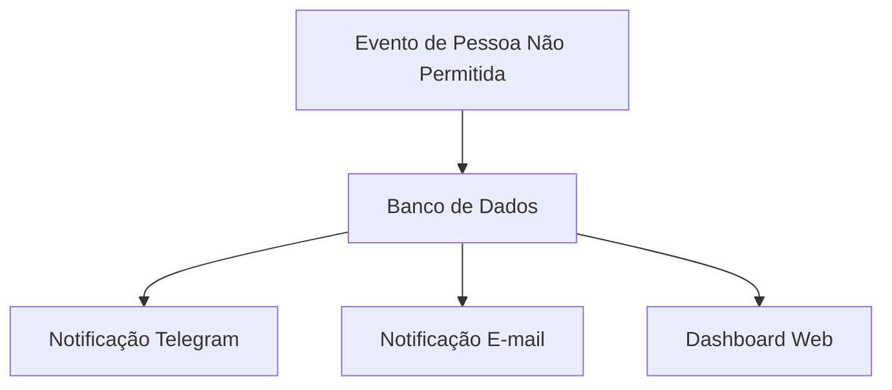

## 4. Notificações (`notificacoes.md`)

**Descrição:** Mostra o fluxo de alertas e como eventos chegam aos canais de notificação.

**Passo a Passo:**

1. Detecção de pessoa não permitida.
2. Registro no banco de dados.
3. Disparo de notificações (Telegram, Email).
4. Atualização do dashboard.
5. Revisão do histórico pelo usuário.

