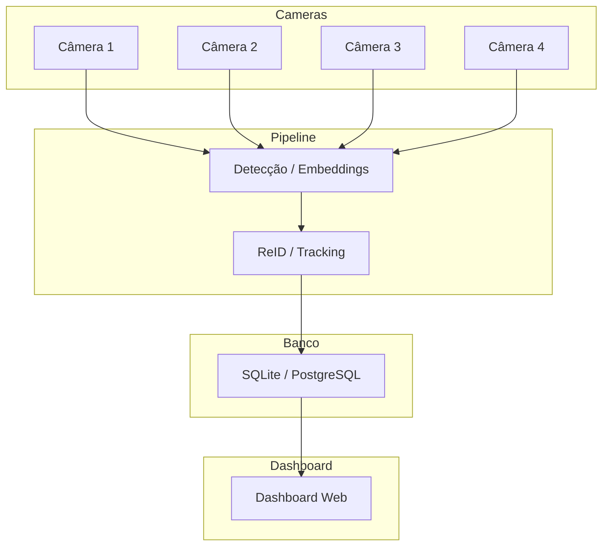

## 5. Multi-Câmeras (`multicameras.md`)

**Descrição:** Mostra como várias câmeras alimentam o pipeline simultaneamente.

**Passo a Passo:**

1. Cada câmera captura vídeo.
2. Todos os streams vão para o mesmo pipeline de detecção/embeddings.
3. Tracking/ReID centralizado evita duplicidade de eventos.
4. Eventos consolidados são armazenados no banco.
5. Dashboard exibe todos os eventos integrados.

